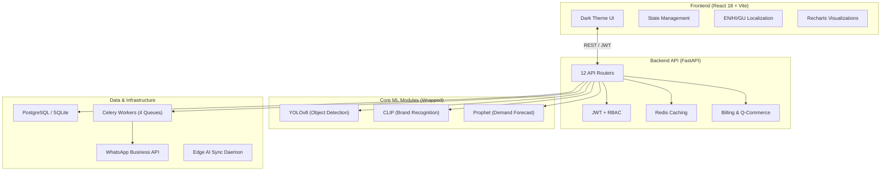

# ShelfIQ v3.0 — Complete Project Report

## 1. Executive Summary

**ShelfIQ** is India's premium Shelf Intelligence Platform designed for supermarkets and retail chains. It uses Computer Vision (YOLOv8 + CLIP) to monitor store shelves in real-time and Machine Learning (Prophet) to forecast demand, specifically tailored for the dynamic Indian retail environment.

Version 3.0 represents a massive architectural upgrade from a collection of standalone ML scripts into a scalable, production-ready SaaS platform. It introduces a modern FastAPI backend, a premium React/Vite frontend dashboard with dark mode, deep India-specific localizations (festivals, i18n, INR pricing), Razorpay billing, Quick-Commerce integrations, and a robust Dockerized infrastructure capable of running in the cloud or at the edge.

---

## 2. Architecture Overview

The system is built on a modern, asynchronous tech stack designed for high performance and scalability.



### Key Architectural Decisions:
1. **"Wrap, don't rewrite"**: The legacy ML modules (`ShelfAnalysisPipeline`, `DemandForecaster`) were intentionally preserved and wrapped with asynchronous FastAPI endpoints. This ensures zero regression in ML accuracy while providing a modern API layer.
2. **Asynchronous by Default**: FastAPI and async SQLAlchemy 2.0 allow the API to handle thousands of concurrent requests without blocking.
3. **Graceful Fallbacks**: The system gracefully falls back to in-memory caching if Redis is unavailable, and SQLite if PostgreSQL is not configured, ensuring easy local development.

---

## 3. Core Features & Capabilities

### A. Shelf Monitoring & Computer Vision
- **Real-Time Detection**: Processes RTSP camera feeds to detect stockouts, low stock, and planogram violations.
- **Compliance Engine**: Generates compliance scores and grades (A/B/C/D) based on product facings and correct shelf placement.

### B. India-Specific Demand Forecasting
- **Festival Impact**: The ML forecast model is enriched with an Indian event calendar (14 major festivals like Diwali, Navratri, IPL). It predicts demand surges and generates "At Risk" alerts for specific categories.
- **Quick-Commerce Ready**: A unified hub to push inventory and pull orders from Blinkit, Zepto, Swiggy Instamart, and BigBasket.

### C. Alerts & Notifications
- **WhatsApp Integration**: Sends critical stockout and planogram alerts directly to store managers via the WhatsApp Business API using approved templates.
- **Alert Center**: A centralized dashboard to view, prioritize (Critical/High/Medium/Low), and resolve alerts with revenue-impact tracking.

### D. Subscriptions & Billing
- **Razorpay Integration**: Handles monthly subscriptions with UPI-first payment flows.
- **Tiered Plans**: Starter (₹4,999/mo), Growth (₹12,999/mo), and Custom Enterprise plans, complete with a 3-day grace period implementation.

---

## 4. Frontend Dashboard (React + Vite)

The frontend is a completely new build designed to look premium, modern, and highly responsive.

- **Tech Stack**: React 18, Vite, TypeScript, Tailwind-inspired custom CSS, Zustand (state), React Query (data fetching), React Router 7, Recharts (visualizations).
- **Design System**: A custom CSS design system featuring dark mode, glassmorphism, gradient brand colors, micro-animations, and WhatsApp-style alert cards.
- **Internationalization (i18n)**: Full support for English, Hindi (हिन्दी), and Gujarati (ગુજરાતી) to cater to store owners and associates across India.
- **9 Core Pages**:
  1. **Login**: Secure entry with JWT persistence.
  2. **Overview**: High-level KPIs, stockout heatmap, and system health.
  3. **Shelves**: Live monitoring table with visual health progress bars.
  4. **Compliance**: SVG ring gauges for planogram adherence.
  5. **Forecast**: Interactive area charts with confidence bands and festival impact cards.
  6. **Alerts**: Unified inbox for critical store events.
  7. **Analytics**: Revenue recovery tracking and historical trends.
  8. **Festival Dashboard**: Urgency-grouped tracking of upcoming Indian holidays.
  9. **Settings**: Profile, language selection, notification preferences, and security status.

---

## 5. Backend API (FastAPI)

The backend exposes a comprehensive RESTful API divided into 12 distinct domains.

- **Authentication**: JWT-based login with AES-256 field encryption for sensitive data.
- **Role-Based Access Control (RBAC)**: 5-level hierarchy (Platform Admin, Store Owner, Store Manager, Analyst, Shelf Associate).
- **12 Endpoint Groups**: All tested and verified (returning HTTP 200).
  - `/auth`, `/stores`, `/shelves`, `/alerts`, `/analysis`, `/forecast`
  - `/compliance`, `/analytics`, `/events`, `/webhooks`, `/billing`, `/qcommerce`
- **Testing**: Includes an automated integration test suite (`test_api_quick.py`) that verifies the health and functionality of all endpoints.

---

## 6. Infrastructure & Deployment

The platform is designed to be deployed either in the cloud (AWS/GCP) or locally at the retail edge.

- **Docker Compose**: A complete 9-service stack defined in `docker-compose.yml` (API, React, Nginx, PostgreSQL, Redis, Celery Workers, Celery Beat).
- **Celery Task Queues**: Heavy lifting (CV processing, forecasting, WhatsApp message dispatch) is offloaded to 4 dedicated background queues.
- **Edge AI**: Includes an `edge/Dockerfile.edge` and `sync_daemon.py` specifically designed for stores with unreliable internet. It runs the ML models locally on hardware like Jetson Nano or Raspberry Pi and syncs data to the cloud when connectivity is restored.
- **CI/CD**: A GitHub Actions workflow (`.github/workflows/ci.yml`) is set up for linting, type-checking, and building Docker images on every push.

---

## 7. Quick Start Guide

### Prerequisites
- Python 3.12+ (Python 3.14 compatible)
- Node.js 20+

### Starting the Backend
```bash
# From the project root (Bug404/Bug404)
pip install -r backend/requirements.txt
python -m uvicorn backend.app.main:app --host 127.0.0.1 --port 8000 --reload
```
*API Docs available at: http://127.0.0.1:8000/docs*

### Starting the Frontend
```bash
# From the frontend directory
cd frontend
npm install
npm run dev
```
*Dashboard available at: http://localhost:5173*

**Demo Credentials**:
- Email: `owner@rajesh-supermart.in`
- Password: `owner123`

---

## 8. Future Roadmap
- **Approve WhatsApp Templates**: Submit Hindi/Gujarati notification templates to Meta for approval.
- **Production Quick-Commerce Keys**: Obtain API keys from Blinkit, Zepto, and Swiggy for live inventory sync.
- **Alembic Migrations**: Implement database version control for production schema evolution.
- **Hardware Integration**: Certify the Edge AI docker container on standard retail CCTV NVR boxes.
